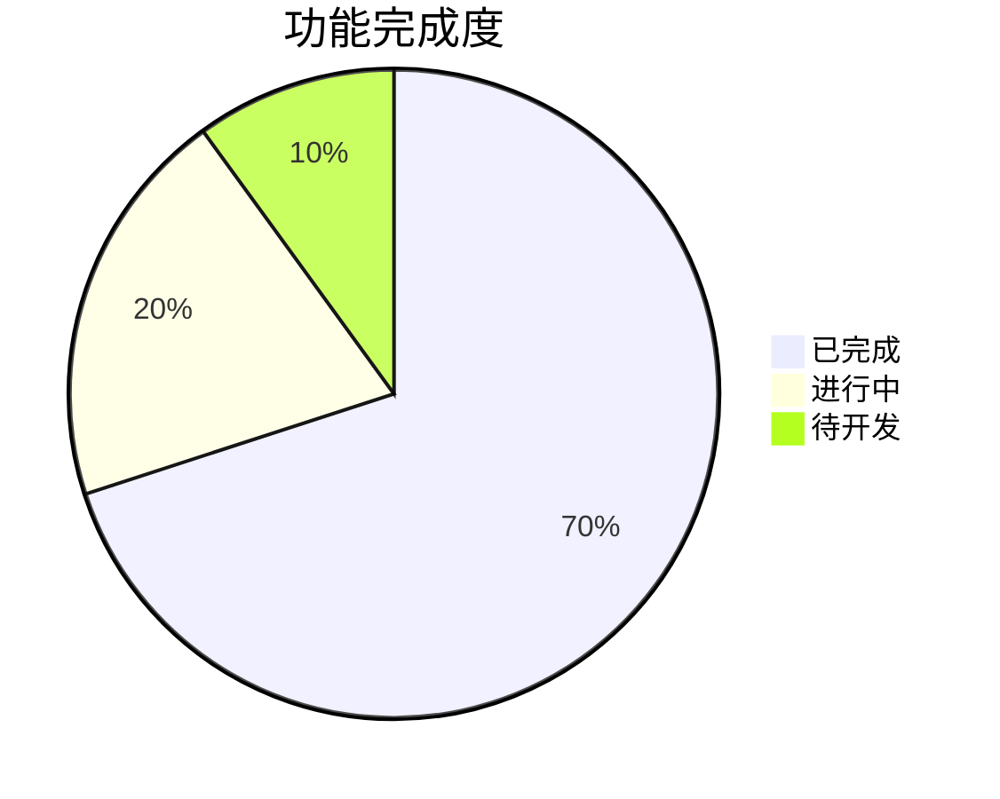

# 薪资计算器进度报告

## 项目状态

### 1. 总体进度

- 项目阶段：开发中
- 完成度：约 70%
- 当前版本：1.0.0 (开发版)
- 目标版本：1.0.0 (正式版)

### 2. 功能完成度

### 3. 模块完成情况

| 模块     | 完成度 | 状态     | 备注     |
| -------- | ------ | -------- | -------- |
| 核心计算 | 90%    | 基本完成 | 需要优化 |
| 数据存储 | 80%    | 基本完成 | 需要完善 |
| 用户界面 | 70%    | 开发中   | 需要改进 |
| 小组件   | 60%    | 开发中   | 需要完善 |
| 数据同步 | 50%    | 开发中   | 需要优化 |
| 性能优化 | 40%    | 进行中   | 需要加强 |

## 已完成功能

### 1. 核心功能

- [x] 基础薪资计算
- [x] 社保公积金计算
- [x] 个税计算
- [x] 奖金计算

### 2. 数据管理

- [x] 本地数据存储
- [x] 数据备份
- [x] 数据恢复
- [x] 数据导出

### 3. 用户界面

- [x] 主界面布局
- [x] 数据输入表单
- [x] 结果展示
- [x] 设置界面

## 进行中功能

### 1. 功能开发

- [ ] 高级计算功能
- [ ] 数据可视化优化
- [ ] 小组件增强
- [ ] 数据同步改进

### 2. 性能优化

- [ ] 启动优化
- [ ] 内存优化
- [ ] 计算优化
- [ ] 存储优化

### 3. 用户体验

- [ ] 界面美化
- [ ] 交互优化
- [ ] 动画效果
- [ ] 反馈机制

## 待开发功能

### 1. 新功能

- [ ] 多方案对比
- [ ] 历史记录分析
- [ ] 数据导出增强
- [ ] 自定义计算规则

### 2. 平台扩展

- [ ] iPad 支持
- [ ] macOS 支持
- [ ] 多语言支持
- [ ] 国际化

### 3. 生态建设

- [ ] 用户社区
- [ ] 分享功能
- [ ] 插件系统
- [ ] API 接口

## 已知问题

### 1. 严重问题

- 数据同步偶尔失败
- 计算精度问题
- 性能瓶颈
- 内存泄漏

### 2. 一般问题

- UI 显示异常
- 操作响应慢
- 数据加载延迟
- 小组件更新不及时

### 3. 轻微问题

- 界面细节不完善
- 提示信息不准确
- 动画效果不流畅
- 文档不完整

## 测试情况

### 1. 单元测试

- 覆盖率：80%
- 通过率：95%
- 待修复：5%
- 新增测试：10%

### 2. 集成测试

- 覆盖率：70%
- 通过率：90%
- 待修复：10%
- 新增测试：15%

### 3. UI 测试

- 覆盖率：60%
- 通过率：85%
- 待修复：15%
- 新增测试：20%

## 性能指标

### 1. 响应时间

- 启动时间：< 2s
- 计算时间：< 1s
- 加载时间：< 1s
- 同步时间：< 3s

### 2. 资源使用

- 内存占用：< 100MB
- CPU 使用：< 30%
- 电池消耗：< 5%/h
- 存储空间：< 50MB

### 3. 稳定性

- 崩溃率：< 0.1%
- 错误率：< 1%
- 恢复率：> 99%
- 成功率：> 99%

## 下一步计划

### 1. 短期目标

- 完成核心功能优化
- 解决已知问题
- 提高测试覆盖率
- 完善文档

### 2. 中期目标

- 实现新功能
- 优化性能
- 改进用户体验
- 扩展平台支持

### 3. 长期目标

- 建立用户社区
- 开发插件系统
- 提供 API 接口
- 实现国际化

## 风险评估

### 1. 技术风险

- 性能问题
- 数据安全
- 兼容性
- 维护成本

### 2. 产品风险

- 用户接受度
- 市场竞争
- 功能需求
- 用户体验

### 3. 项目风险

- 进度控制
- 资源分配
- 质量保证
- 团队协作
