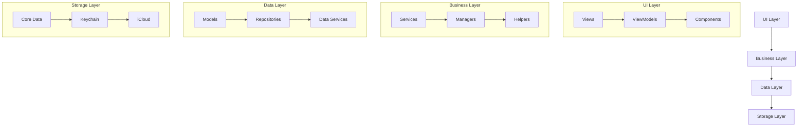
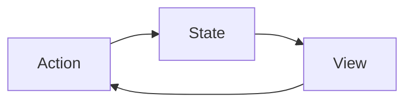

# 薪资计算器系统模式

## 系统架构

### 整体架构



### 架构说明

1. **UI Layer**

   - Views: 用户界面组件
   - ViewModels: 视图模型，处理业务逻辑
   - Components: 可复用 UI 组件

2. **Business Layer**

   - Services: 核心业务服务
   - Managers: 功能管理器
   - Helpers: 辅助工具类

3. **Data Layer**

   - Models: 数据模型
   - Repositories: 数据仓库
   - Data Services: 数据服务

4. **Storage Layer**
   - Core Data: 本地数据存储
   - Keychain: 敏感数据存储
   - iCloud: 云端数据同步

## 设计模式

### 1. MVVM 模式

```swift
// View
struct SalaryView: View {
    @StateObject private var viewModel = SalaryViewModel()

    var body: some View {
        // UI implementation
    }
}

// ViewModel
class SalaryViewModel: ObservableObject {
    @Published var salary: Double = 0
    private let service: SalaryService

    // Business logic implementation
}

// Model
struct Salary: Codable {
    let amount: Double
    let date: Date
    // Other properties
}
```

### 2. 依赖注入

```swift
protocol SalaryServiceProtocol {
    func calculateSalary() -> Double
}

class SalaryService: SalaryServiceProtocol {
    // Implementation
}

class SalaryViewModel {
    private let service: SalaryServiceProtocol

    init(service: SalaryServiceProtocol) {
        self.service = service
    }
}
```

### 3. 观察者模式

```swift
class DataManager: ObservableObject {
    @Published var currentData: SalaryData?

    func updateData() {
        // Update implementation
    }
}
```

### 4. 工厂模式

```swift
protocol WidgetFactory {
    func createWidget(type: WidgetType) -> Widget
}

class SalaryWidgetFactory: WidgetFactory {
    func createWidget(type: WidgetType) -> Widget {
        // Implementation
    }
}
```

## 数据流

### 1. 单向数据流



### 2. 数据更新流程

1. 用户操作触发 Action
2. Action 通过 ViewModel 处理
3. ViewModel 调用 Service
4. Service 更新数据
5. 数据变化通知 View 更新

## 组件通信

### 1. 组件间通信方式

- 属性传递
- 环境对象
- 通知中心
- 回调函数

### 2. 数据共享

- AppStorage
- UserDefaults
- Core Data
- iCloud

## 错误处理

### 1. 错误类型

```swift
enum AppError: Error {
    case calculationError
    case dataError
    case networkError
    case storageError
}
```

### 2. 错误处理策略

- 本地错误处理
- 全局错误处理
- 用户友好提示
- 错误日志记录

## 性能优化

### 1. 缓存策略

- 内存缓存
- 磁盘缓存
- 网络缓存

### 2. 性能监控

- 启动时间
- 响应时间
- 内存使用
- CPU 使用

## 安全机制

### 1. 数据安全

- 敏感数据加密
- 安全存储
- 数据传输安全

### 2. 访问控制

- 权限管理
- 数据隔离
- 安全验证

## 测试策略

### 1. 测试类型

- 单元测试
- 集成测试
- UI 测试
- 性能测试

### 2. 测试覆盖

- 核心功能测试
- 边界条件测试
- 错误处理测试
- 性能测试
